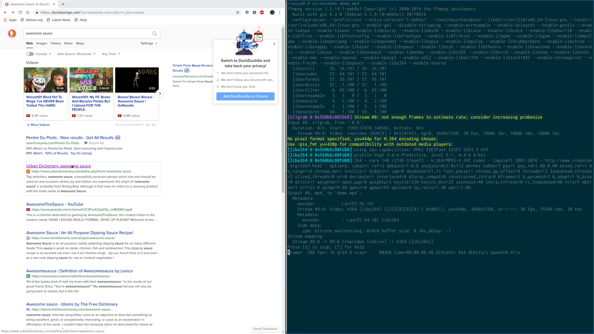

# Overview

A small X program which facilitates recursively warping the pointer to different quadrants on the screen. The program was inspired by the mousekeys feature of Kaleidoscope, the firmware for the Keyboardio.

# Installation

Requires libxinerama-dev, libxft-dev, libxfixes-dev, libxtst-dev, and libx11-dev on debian. You will need to install the equivalent packages containing the appropriate header files on your distribution.

```
sudo apt-get install libxinerama-dev libxft-dev libxfixes-dev libxtst-dev libx11-dev && make && sudo make install
```

## Getting Started

1. Run `warp -d` 
2. Press M-x (meta is the command key) to activate the warping process.
3. Use u,i,j,k to repeatedly navigate to different quadrants.
4. Press m to click.
5. Press enter to finish.
6. RTFM
7. For luck.

# Overview

By default `warp` divides the screen into a 2x2 grid. Each time a key
is pressed the grid shrinks to cover the targetted area. Once the pointer
covers the target `m` can be pressed to simulate a mouse click.


E.G

```
         +--------+--------+            +--------+--------+
         |        |        |            |  u |  i |       |
         |   u    |   i    |            |----m----+       |
 M-x     |        |        |     u      |  j |  k |       |
----->   +-----------------+   ----->   +---------+       |
         |        |        |            |                 |
         |   j    |   k    |            |                 |
         |        |        |            |                 |
         +--------+--------+            +--------+--------+
```

## Demo



# Hint Mode

This is an experimental mode which populates the screen with a list of labels and
allows the user to immediately warp the pointer to a given location by pressing
the corresponding key sequence. It is similar to functionality provided by
browser plugins like Vimperator but works outside of the browser and
indiscriminately covers the entire screen. 

## Demo


## Notes

Rather than saturating the screen with labels it is recommended that the user leave
a few gaps and then use the movement keys (hjkl) to move to the
final location. The rationale for this is as follows: 

- **Efficiency**: A large number of labels necessitates the use of longer keysequences (since there are a finite number of two-key sequences) at which point the value of the label system is supplanted by manual mouse movement.

- **Usability**: Packing every inch of the screen with labels causes a loss of context by obscuring UI elements.

- **Performance**: Drawing routines have been optimized with a 20x20 grid in mind (the default) increasing the grid size beyond this may yield sub par performance.

By tweaking hints_nc and hints_nr it should be possible to make most screen
locations accessible with 2-4 key strokes. After a bit of practice this becomes
second nature and is (in the author's opinion) superior to the grid method for
quickly pinpointing text and UI elements.

# Config Options

The following configuration options can be placed in ~/.warprc to modify the behaviour of the program. Each option must be specified
on its own line and have the format 

```
<option>: <value>
```

 **grid_keys** \<key\>[,\<key\>...]: A sequence of comma delimited keybindings which are ordered by their corresponding position in the grid. (default: u,i,j,k)

 **activation_key** \<key\>: Activates grid or hint mode (if enabled) and allows for further manipulation of the pointer using the mapped keys. (default: M-x)

 **up**  \<key\>: Move the entire frame up by a fixed interval. (default: w)

 **left**  \<key\>: Move the entire frame left by a fixed interval. (default: a)

 **down**  \<key\>: Move the entire frame down by a fixed interval. (default: s)

 **right**  \<key\>: Move the entire frame right by a fixed interval. (default: d)

 **close_key**  \<key\>: Prematurely terminate the movement session (default: Escape)

 **buttons**  \<key\>[,\<key\>]: A list of keys corresponding to buttons (default: m,comma,period).

 **nc** \<num\>: The number of columns in the grid. (default: 2)

 **nr** \<num\>: The number of rows in the grid. (default: 2)

 **movement_increment** \<num\>: The size of the fixed interval used by the movement keys. (default: 20)

 **trigger_mods** \<mod1\>[-\<mod2\>...]: A set of modifiers which, when used in conjunction with the grid keys, immediately activates the grid and moves to the corresponding quadrant. E.G if set to `M-A` then `M-A-u` (where `M` is the windows key) will immediately warp to the first quadrant when pressed. (default: unset)

 **hint_mode** \<true|false\>: Enables an alternative mode which displays a group of labels and allows the user to immediately warp the cursor to the desired location. (default: false)

 **hint_nc** \<num\>: The number of columns in hint mode. (default: 20)

 **hint_nr** \<num\>: The number of rows in hint mode. (default: 20)

 **hint_left** \<key\>: Moves the cursor left by movement_increment once a label has been selected in hint mode. (default: h)

 **hint_down** \<key\>: Moves the cursor down by movement_increment once a label has been selected in hint mode. (default: j)
 l
 **hint_up** \<key\>: Moves the cursor up by movement_increment once a label has been selected in hint mode. (default: k)

 **hint_right** \<key\>: Moves the cursor right by movement_increment once a label has been selected in hint mode. (default: l)

 **hint_bgcol** \<#hexcolor\>: The background hint color. (default: #00ff00)

 **hint_fgcol** \<#hexcolor\>: The foreground hint color. (default: #000000)

 **grid_col** \<#hexcolor\>: The color of the grid. (default: #00ff00)

 **grid_mouse_col** \<#hexcolor\>: The color of the mouse indicator. (default: #00ff00)


# Examples

The following ~/.warprc causes warp to use a 3 by 3 grid instead of the default 2 by 2 grid with u,i,o corresponding to the columns in the top row and n,m,comma corresponding to the columns in the bottom row.

```
nr: 3
nc: 3
grid_keys: u,i,o,j,k,l,n,m,comma
```

Enables hint mode (activated by M-x).

```
hint_mode: true
```

# Limitations/Bugs

- No multi monitor support (it may still work by treating the entire display as one giant screen, I haven't tried this). If you use this program and desire this feature feel free to harass me via email or submit a pull request.

- Warp wont activate if the keyboard has already been grabbed by another program (including many popup menus). Using a minimalistic window manager is recommended :P.
See [#3](https://github.com/rvaiya/warp/issues/3) for details.

- This was a small one off c file that ballooned into a small project, I did not originally plan to publish it. Consequently the code is ugly/will eat your face. You have been warned.
