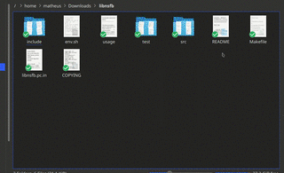
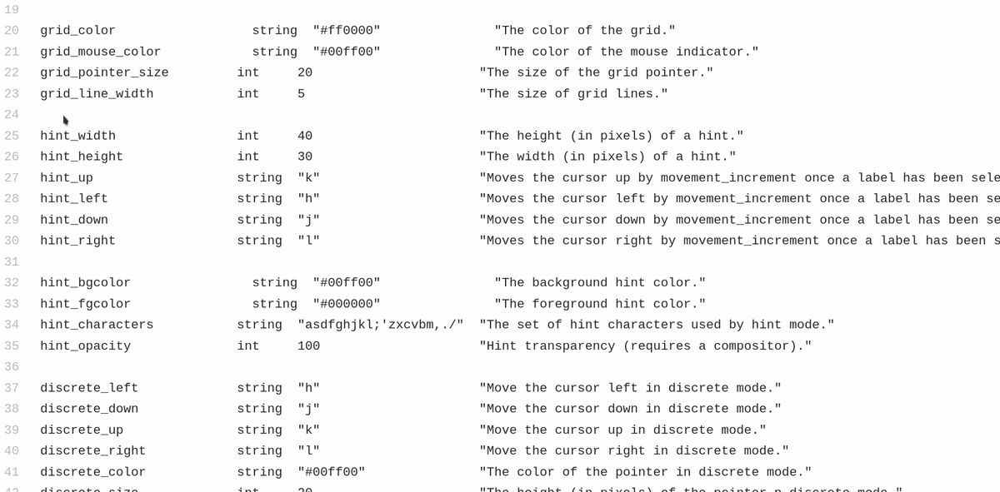

# Overview

A small X program which provides different mechanisms for manipulating the cursor using the keyboard. The program was originally inspired by the mousekeys feature of Kaleidoscope, the firmware for the Keyboardio.

# Installation

Requires `libxi-dev` `libxinerama-dev`, `libxft-dev`, `libxfixes-dev`, `libxtst-dev`, and `libx11-dev` on debian. You will need to install the equivalent packages containing the appropriate header files on your distribution.

E.G 

```
sudo apt-get install libxi-dev libxinerama-dev libxft-dev libxfixes-dev libxtst-dev libx11-dev && make && sudo make install
```

# Demo

## Hint Mode

<p align="center">

</p>

## Grid Mode

<p align="center">

</p>

## Discrete Mode

<p align="center">


</p>

# Quickstart

1. Run `warpd` 

## Grid Mode
2. Press `M-x` (meta is the command key) to activate the warping process.
3. Use `u`,`i`,`j`,`k` to repeatedly navigate to different quadrants.
4. Press `m` to left click, `,` to middle click or `.` to right click. 

## Hint Mode
2. Press `M-z` to generate a list of hints
3. Enter the key sequence associated with the desired target to warp the pointer to that location and enter discrete mode.
4. Use the discrete mode movement keys to select the final desination (see below). 

## Discrete Mode
2. Press `M-c` to activate discrete mode.
3. Use the discrete movement keys (default `hjkl`) to adjust the cursor.
4. Press `m` to left click, `,` to middle click or `.` to right click. 

A drag movement can be simulated from any of the above modes by focusing on the source and then pressing the `drag_key` (default `v`) which will cause the same mode to be reactived for selection of the drag target.

A more comprehensive description can be found in the man page (along with a list of options).

# Packages:

`warpd` is currently available on the following distributions:

## Arch

Available as an [AUR](https://aur.archlinux.org/packages/warpd-git/) package (maintained by Matheus Fillipe).

If you are interesting in adding warpd to your distribution's repository please contact me.

# Limitations/Bugs

- No multi monitor support (it may still work by treating the entire display as one giant screen, I haven't tried this). If you use this program and desire this feature feel free to harass me via email or file an issue.

- Programs which use Xinput and or Xtest for keyboard may not work correctly (e.g synergy). If a specific program which you feel should be working does not please file an [issue](https://github.com/rvaiya/warpd/issue).

- This was a small one off c file that ballooned into a small project, I did not originally plan to publish it. Consequently the code is ugly/will eat your face. You have been warned.

